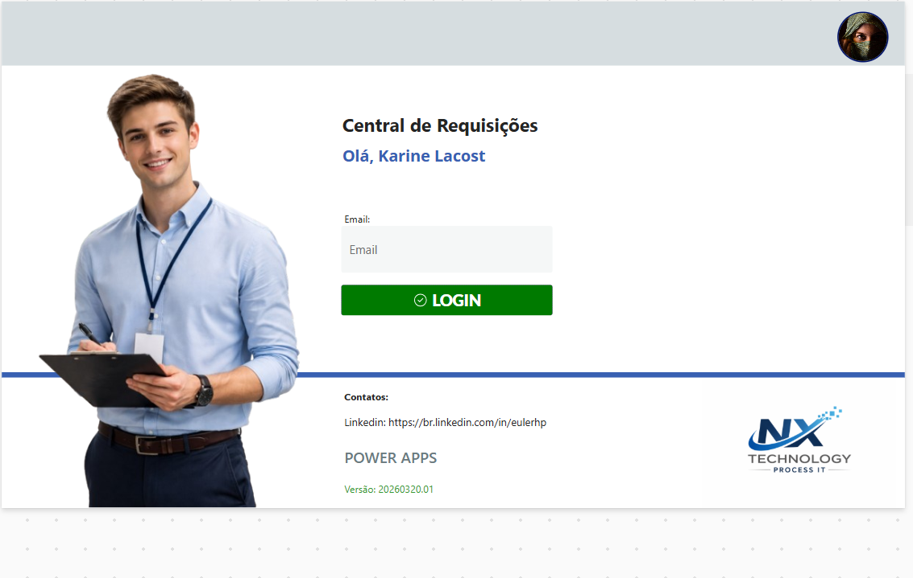
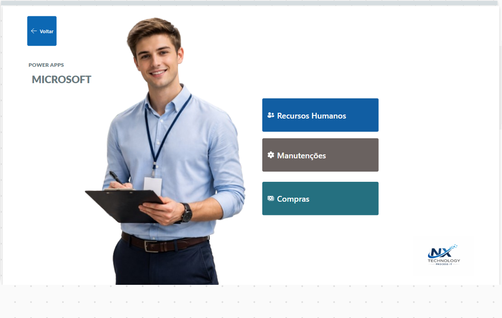
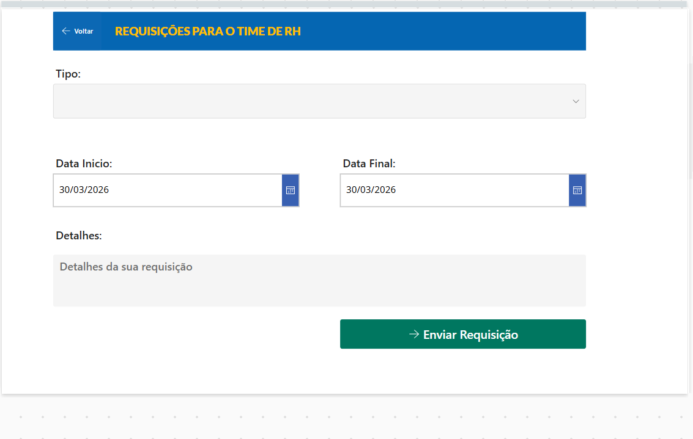
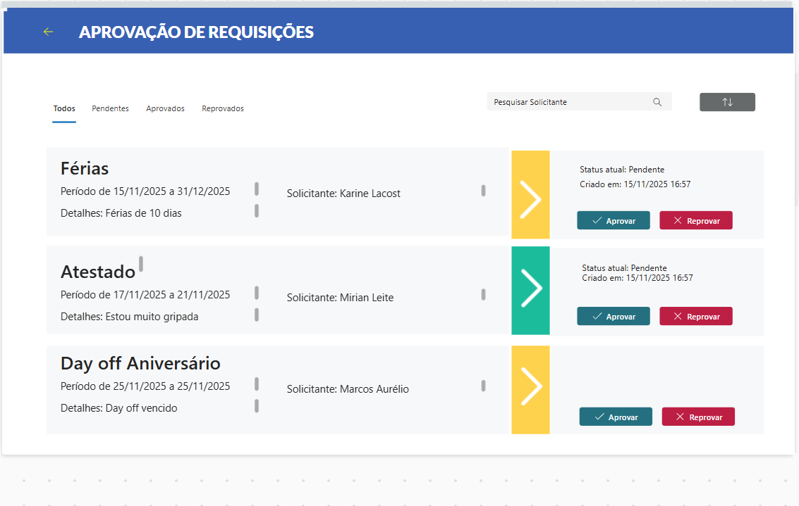

<h1 align="center">🚀 App PowerApps - Automação de Processos</h1>

  Sistema de requisições desenvolvido com Power Apps, focado em automação e eficiência operacional

---

## 📌 Sobre o Projeto

Aplicação criada para gerenciar requisições internas de forma automatizada, permitindo controle de processos como:

- 📄 Solicitação de requisições
- 👥 Fluxos de RH
- 🛒 Processos de compras
- 🔄 Integração com SharePoint

---

## 🛠️ Tecnologias Utilizadas

- Power Apps
- Power Automate
- SharePoint
- Excel (Integrações)

---

## 📷 Demonstração

  

  

  

  

  

---

## 🚀 Funcionalidades

- ✔️ Cadastro e gerenciamento de requisições  
- ✔️ Automação de processos internos  
- ✔️ Interface intuitiva  
- ✔️ Integração com serviços corporativos  

---

## 📈 Objetivo

Automatizar processos manuais e reduzir tempo operacional, aumentando a eficiência e organização das demandas internas.

---

## 👨‍💻 Autor

**Euler Henrique Pereira**

- 📧 eulermgtec@gmail.com  
- 💼 LinkedIn: https://www.linkedin.com/in/eulerhp  

---

## ⭐ Observação

Este projeto faz parte do meu portfólio profissional com foco em automação de processos e desenvolvimento de soluções empresariais.
